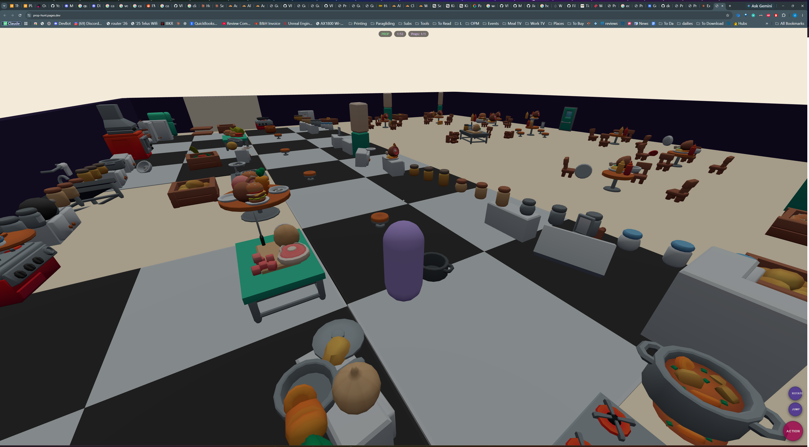
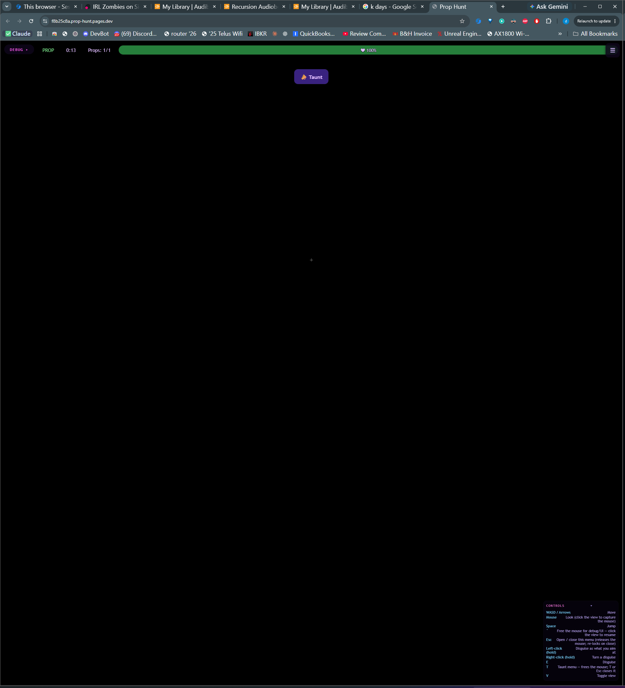

# Prop Finder — hunter tool #2 (2026-07-17, VRmike)

> **B3 BALANCE UPDATE (2026-07-18):** `finderRadius` was tuned **8 → 13.6 m** (+70%, playtest
> range buff). The "8 m" figures below are the ORIGINAL default — the live value is in
> `shared/config/rules.json`. All mechanics are identical; only the radius grew. See
> `notes/balance-tuning.md`. (WATCH: may be too strong in the restaurant's tight rooms.)

The hunter's second selectable tool alongside the rifle (grenades come later, not this build).
Purpose: help hunters LOCATE hiding props — currently too hard — by forcing every prop in an AOE
to taunt (self-snitch through the existing 3D taunt audio).

VRmike's HUD-context screenshots for this request: the tool bar sits TOP-LEFT (the finder button
lives beside the rifle), the taunt button TOP-CENTRE — this build keeps that layout.
 

> **SOUND-FOR-ALL UPDATE (2026-07-18, VRmike):** the finder ping is now heard by EVERYONE, not
> just the activating hunter. On a SUCCESSFUL `applyFind`, the host also broadcasts a small
> `S2C.EVENT kind:'finderPing' {by, x, y, z}` carrying ONLY the ping's world position. Every client
> plays it as positional 3D audio through the SAME combat-SFX path (`playCombatSoundAt('finderPing')`
> → `scene.playPositionalSound` → master limiter). The activating hunter IGNORES its own echo
> (`msg.by !== state.selfId`) — they keep their instant local ping off the private `kind:'find' ok`
> reply (no double-ping, no network lag on their own click). ANTI-LEAK: the event carries a POSITION
> ONLY, never any prop/target data, and the finder is a HUNTING-phase tool, so the blindfold/
> withholding rules are untouched. Nice side effect (the point of the ask): props get an audio warning
> a hunter is scanning nearby. Guarded in `check-finder.mjs` §G. See `notes/combat-sfx.md`.

## What it does (spec, faithfully)

- **Selectable tool** (weapon-slot style): number keys 1/2 on PC, the on-screen tool bar on
  mobile — reuses the existing HUNTER_TOOLS framework (`js/main.js`), no new selection plumbing.
- **AOE zone** while selected: a large TRANSLUCENT CYLINDER centred on the hunter, radius
  `rules.finderRadius` (8 m), effectively infinite height (a 200 m open-ended tube centred on the
  player — reads floor-to-ceiling, no caps to z-fight). Follows the hunter each frame. GREEN @ 40 %
  opacity when ready, GREY @ 20 % while cooling. `scene.updateFinderZone({visible,ready,radius,pos})`.
- **Activation**: LEFT-CLICK on PC (the primary/fire action) / the existing fire button on mobile,
  while the finder is selected. `tryFire()` routes to `tryFinder()` when `state.tool === 'finder'`.
- **Forced taunts**: EVERY LIVING PROP whose position is within `finderRadius` of the hunter (2D
  distance — height ignored, matching the infinite cylinder) is forced to play a RANDOM taunt from
  the real library, UNCANCELLABLE. Reuses the pre-existing `referee.forceTaunt(propId)` hook — the
  taunt system itself is UNTOUCHED.
- **Cooldown**: `rules.finderCooldownSeconds` (20 s), PER-HUNTER (`player._lastFindAt`, never
  shared), enforced HOST-SIDE. Countdown shown right on the tool button ("Finder (14s)",
  `ui.setToolCooldown`). Resets clean to ready on round/lobby transitions + when the time elapses.
- **Rejection feedback**: clicking during cooldown plays a short, quiet, synthesized denied buzz
  (`assets/finder/deny.wav`, generated by `tools/gen-finder-deny.mjs` — our own tone, NOT a ripped
  Windows sound). Played non-positionally via `scene.playUiSound`.
- **Prop taunt-UI lock**: while a finder-FORCED (uncancellable) taunt plays on the local prop, their
  taunt button greys/disables (`ui.setTauntLocked`) and they can't open the menu / start their own
  taunt until it finishes (`state.tauntLocked` gates `openTauntMenu`/`sendTaunt`; a timer sized to
  the clip auto-releases). The host-side "stop is ignored while uncancellable" was already in place.

## Netcode (host-authoritative, matches the rifle)

`C2S.FIND {}` (no payload — the host knows the hunter's authoritative position/radius/cooldown) →
`referee.applyFind`:
1. reject unless a LIVING HUNTER in HUNTING (hunters are frozen/blind in HIDING, like the rifle);
2. per-hunter cooldown check (`_lastFindAt`); if cooling → reply `S2C.EVENT kind:'find' {ok:false,
   remainMs}` (client plays the denied buzz + syncs its countdown);
3. else stamp `_lastFindAt`, iterate players, `forceTaunt(prop.id)` for each living prop within
   radius (2D), reply `{ok:true, cooldownMs, hits}`.

The forced taunts ride the normal `kind:'taunt'` (uncancellable:true) broadcast, so all clients hear
the victims taunt positionally through the existing `THREE.PositionalAudio` path — no new audio code.

The client tracks its OWN cooldown (`state.finderCooldownUntil`, set optimistically on send,
reconciled by the host reply) purely for the countdown display + instant denied-buzz feedback; the
host is the authority on whether a taunt actually fires (a hacked client can't skip the cooldown).

## Files

- `shared/config/rules.json` — `finderRadius` (8), `finderCooldownSeconds` (20), both hot-tunable.
- `shared/protocol.js` — `C2S.FIND` + `S2C.EVENT kind:'find'` doc.
- `shared/referee.js` — `applyFind` + `_finderRadius`/`_finderCooldownMs`; `_lastFindAt` init/reset
  in `addPlayer`/`startMatch`/`resetToLobby`. (forceTaunt/applyTaunt/applyStopTaunt UNCHANGED.)
- `js/main.js` — `tryFinder`, `finderCooldownMs`/`finderRadius`, `playFinderDenied`,
  `updateFinderHud`, `setTauntLocked`, `resetFinderState`; `case 'find'`; onTaunt forced-lock;
  finder routing in `tryFire`; state fields `finderCooldownUntil`/`tauntLocked`.
- `js/scene.js` — `updateFinderZone` (the cylinder) + `playUiSound`; reset in `buildWorld`.
- `js/ui.js` — `setToolCooldown` (button countdown) + `setTauntLocked`; `.tool-name`/`baseName`.
- `css/style.css` — `.tool-btn.cooling`, `.taunt-btn.locked`.
- `tools/gen-finder-deny.mjs` (new) → `assets/finder/deny.wav`. `tools/check-finder.mjs` (new).

## Guard: tools/check-finder.mjs

Drives the REAL referee: config knobs exist; forced-taunt targets are EXACTLY the props inside 8 m
(2D — proves a prop 50 m above but within the flat radius IS hit, dead props / other hunters NOT);
per-hunter cooldown independence + host enforcement; cooldown resets on `resetToLobby` and on
elapse; rejection for non-hunter/dead/wrong-phase; plus source assertions for the client zone /
denied buzz / taunt-UI lock and the deny WAV asset.

## OWED — live pass (headless can't do audio/render/peers)

One real match: cylinder GREEN when ready / GREY while cooling and it follows the hunter; a mobile
activation via the fire button; victims audibly taunt for everyone (positional); the "Finder (14s)"
countdown ticks and resets clean across a round; two hunters have independent cooldowns; a forced
prop's taunt button locks then releases; the denied buzz plays on a cooldown click.

## Tuning (VRmike)

`finderRadius` + `finderCooldownSeconds` in `shared/config/rules.json` — one-line change, no rebuild
of logic (both host + client read them live). VRmike expects to adjust both in testing.
